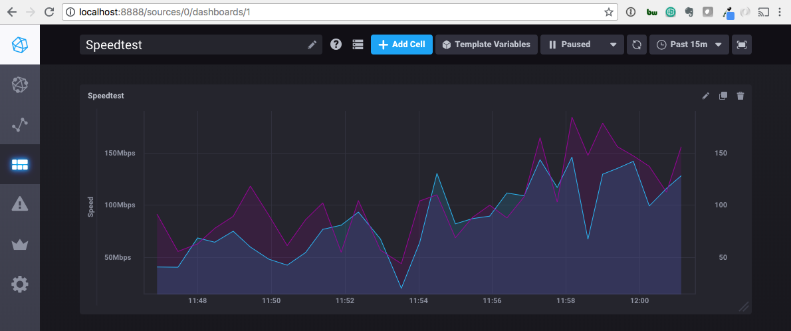

# Internet Speedtest Dashboard

This project is designed to provide you an easy dashboard for consistently monitoring the speed of your Internet connection. It won't help you diagnose any issues, or notify anyone of issues, it's purely designed to provide historical reporting. It was also built as a standalone piece to integrate with my [Docker based HTPC Standup](https://github.com/phikai/htpc-docker-standup).

Huge thanks to [Pedro Azevedo](https://github.com/pedrocesar-ti) for his [Speedtest Dashboard](https://github.com/pedrocesar-ti/internet-speedtest-docker) project which was the base for this project.



## Running Containers
The only requirement to run this is having Docker Compose installed. Further information on the install process can be found in the [docs](https://docs.docker.com/compose/install/). After installed, the only thing you need to do is export any appropriate variables and configure the volume for persistent data, then run `docker-compose up -d`.

```console
$ git clone https://github.com/phikai/docker-internet-speedtest-dashboard
$ cd docker-internet-speedtest-dashboard

$ docker-compose up -d 
```

## Docker Compose
Docker Compose is a tool to help orchestrate and run multi-container applications. It's used here to connect the requred Database, Dashboard and Speedtest Client containers to make everything work. They are described below:

### InfluxDB
InfluxDB is a database tool based on time-series, so every event is registered with their timestamp.

This project uses the official InfluxDB image hosted in the Docker Hub Library.

You can edit or remove the volumes section of the docker-compose.yml file to reflect where you want you persistent data to live, or you can remove it if you like.   If you remove the volume mount you will lose all of your data if the container is removed. `INFLUXDB_DB` is **required** to be `speedtest` for associated scripts in other containers to work.

```
services:
  influxdb:
    image: influxdb 
    container_name: influxdb
    restart: unless-stopped
    network_mode: 'bridge'
    ports:
      - '8086:8086'
    environment:
      - INFLUXDB_DB=speedtest
    volumes:
      - './influxdb:/var/lib/influxdb'
```

### Chronograf
Chronograf is a tool to create and manage dashboards and graphs; built by the same team who built InfluxDB. 

This project uses the official Chronograf image from the Docker Hub Library.

```
  chronograf:
    image: chronograf 
    container_name: chronograf
    restart: unless-stopped
    network_mode: 'bridge'
    ports:
      - '8888:8888'
    environment:
      - INFLUXDB_URL=http://db:8086
    volumes:
      - './chronograf:/var/lib/chronograf'
    links:
      - influxdb:db
    depends_on:
      - influxdb
```


### SpeedTest
This image was created to run a custom script that calls speedtest-cli to test your internet connection speed and post the data to the running InfluxDB instance. [SpeedTest CLI](https://github.com/sivel/speedtest-cli/) is a client for the popular [Speedtest](http://www.speedtest.net/) service. It tests your internet connectivity speed by sending requests to download and upload data from a geographically close testing server.

This project uses a custom [Speedtest Container](https://github.com/phikai/docker-speedtest) available via the Docker Hub Library.

```
  speedtest:
    image: phikai/speedtest
    container_name: speedtest
    restart: unless-stopped
    network_mode: 'bridge'
    environment:
      - TEST_INTERVAL=5
    links:
      - influxdb:db
    depends_on:
      - influxdb
```

The only variable to customize on this image is a variable to set the frequency that this script will run.

| Variables  | Default | Function |
|---------|--------|--------|
| **TIME_INTERVAL** | 5 | Time (in sec.) to set how long will sleep the script until run again. |

---

### Credits
* [Pedro Azevedo](https://github.com/pedrocesar-ti)
* [InfluxDB](https://www.influxdata.com/) 
* [Chronograf](https://www.influxdata.com/time-series-platform/chronograf/)
* [SpeedTest](https://github.com/sivel/speedtest-cli/)

---

If this project has helped you in anyway, and you'd like to say thanks...

[](https://cash.me/$phikai)
[](https://en.cryptobadges.io/donate/15JCkpHhjjVmWYaTBc2fJn4tcKHEd194gY)

---

# Disclaimer

THE SOFTWARE IS PROVIDED "AS IS", WITHOUT WARRANTY OF ANY KIND, EXPRESS OR
IMPLIED, INCLUDING BUT NOT LIMITED TO THE WARRANTIES OF MERCHANTABILITY,
FITNESS FOR A PARTICULAR PURPOSE AND NONINFRINGEMENT. IN NO EVENT SHALL THE
AUTHORS OR COPYRIGHT HOLDERS BE LIABLE FOR ANY CLAIM, DAMAGES OR OTHER
LIABILITY, WHETHER IN AN ACTION OF CONTRACT, TORT OR OTHERWISE, ARISING FROM,
OUT OF OR IN CONNECTION WITH THE SOFTWARE OR THE USE OR OTHER DEALINGS IN THE
SOFTWARE.

